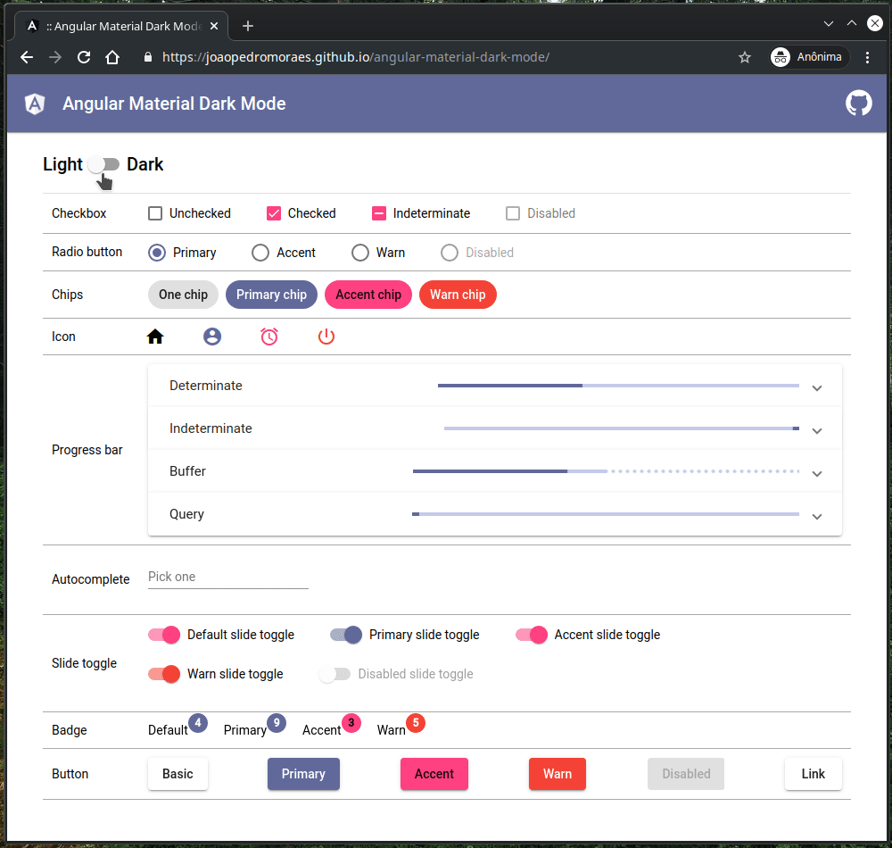

<h1 align="center">
 Angular Material Dark Mode
</h1>

## :rocket: Sobre a aplicação

Demonstração de como implementar dark mode em aplicações Angular :smile:



## Tecnologias utilizadas :memo:

- [Angular](https://angular.io)
- [Angular Material](https://material.angular.io/)
- [TypeScript](https://www.typescriptlang.org)
- [Angular CLI](https://cli.angular.io)
- [Node](https://nodejs.org/en/)
- [localStorage](https://developer.mozilla.org/en-US/docs/Web/API/Window/localStorage)

## Como utilizar 🤔

É necessário que você tenha o `angular-cli` instalado em sua máquina para que você consiga utilizar o `ng serve`, para subir o seu projeto.

Para insalar basta rodar o comando abaixo:

```
npm install -g @angular/cli
```

Agora clone este repositório.

```
git clone https://github.com/JoaoPedroMoraes/angular-material-dark-mode
```

Entre na pasta `github-explore-angular` e rode o comando `yarn` ou `npm install`, para instalar as dependências do projeto.

Agora é só rodar o comando `ng serve` dentro da pasta do projeto !

```
cd angular-material-dark-mode

ng serve --hmr
```

Pronto ! Agora basta acessar `http://localhost:4200` :smile:

## Veja a aplicação no ar :tada:

[Angular Material Dark Mode](https://joaopedromoraes.github.io/angular-material-dark-mode/)
## License/Licença do Projeto
[MIT License](./LICENSE.md) © [João Pedro Moraes](http://github.com/joaopedromoraes)